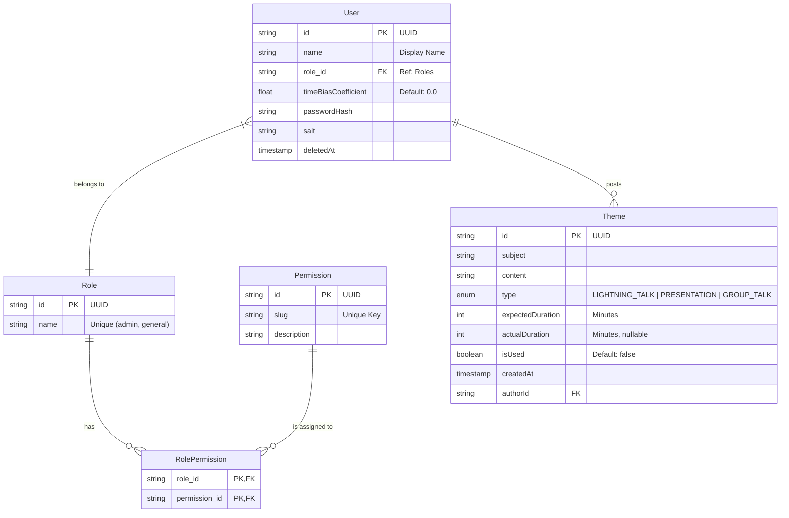

# ライトニングトーク会用 お題箱アプリケーション 設計書

## 1. システムアーキテクチャ (System Architecture)

### 1.1 システム構成

本システムは Next.js (App Router) と Database の2層構造とし、Docker Compose 上で動作する。
Frontend と Backend API は Next.js フレームワーク内に統合される。

- **Framework**: Next.js (React Server Components, App Router)
- **Database**: PostgreSQL
- **Infrastructure**: Docker / Docker Compose

### 1.2 コンテナ構成

(docker-compose.yml の構成予定)

- **app**: Next.js アプリケーション (Node.js)
- **db**: PostgreSQL データベース

## 2. データベース設計 (Database Design)

### 2.1 ER図 (Entity Relationship)

データモデルは Prisma Schema を使用して定義・管理する。
以下は概念的なER図である。



### 2.2 テーブル定義

#### 2.2.1 Users テーブル

| カラム名              | 型        | 制約         | 説明                  |
| :-------------------- | :-------- | :----------- | :-------------------- |
| id                    | UUID      | PK           | ユーザーID            |
| name                  | VARCHAR   | NOT NULL     | 表示名                |
| role_id               | UUID      | FK, NOT NULL | ロールID (Roles.id)   |
| time_bias_coefficient | DOUBLE    | DEFAULT 0.0  | 予想時間のズレ係数    |
| password_hash         | VARCHAR   | NOT NULL     | パスワードハッシュ    |
| salt                  | VARCHAR   | NOT NULL     | パスワードソルト      |
| deleted_at            | TIMESTAMP | NULL         | 削除日時 (論理削除用) |

#### 2.2.2 Roles テーブル

| カラム名 | 型      | 制約             | 説明                      |
| :------- | :------ | :--------------- | :------------------------ |
| id       | UUID    | PK               | ロールID                  |
| name     | VARCHAR | UNIQUE, NOT NULL | ロール名 (admin, general) |

#### 2.2.3 Permissions テーブル

| カラム名    | 型      | 制約             | 説明                          |
| :---------- | :------ | :--------------- | :---------------------------- |
| id          | UUID    | PK               | 権限ID                        |
| slug        | VARCHAR | UNIQUE, NOT NULL | 権限識別子 (例: draw_omikuji) |
| description | TEXT    |                  | 権限の説明                    |

#### 2.2.4 RolePermissions テーブル (中間テーブル)

| カラム名      | 型   | 制約   | 説明           |
| :------------ | :--- | :----- | :------------- |
| role_id       | UUID | PK, FK | Roles.id       |
| permission_id | UUID | PK, FK | Permissions.id |

#### 2.2.5 Themes テーブル

| カラム名          | 型        | 制約          | 説明                                                    |
| :---------------- | :-------- | :------------ | :------------------------------------------------------ |
| id                | UUID      | PK            | お題ID                                                  |
| subject           | VARCHAR   | NOT NULL      | 件名                                                    |
| content           | TEXT      | NOT NULL      | 本文                                                    |
| type              | VARCHAR   | NOT NULL      | お題タイプ (LIGHTNING_TALK / PRESENTATION / GROUP_TALK) |
| expected_duration | INTEGER   | NOT NULL      | 予想所要時間(分)                                        |
| actual_duration   | INTEGER   | NULL          | 実績所要時間(分)                                        |
| is_used           | BOOLEAN   | DEFAULT FALSE | 消化済みフラグ                                          |
| author_id         | UUID      | FK            | 投稿者ID (Users.id)                                     |
| created_at        | TIMESTAMP | DEFAULT NOW() | 作成日時                                                |

## 3. API設計 / Server Actions

Next.js App Router の機能を活用し、クライアントからの操作は Server Actions を主体に実装する。
クライアントのコンテキスト依存が強い処理や外部システムとの連携が必要な場合は Route Handlers (`/app/api/`) を使用する。

### 3.1 Server Actions (Main Operations)

サーバー関数は `use server` ディレクティブを使用して定義する。

#### Auth Actions

- `login(formData)`: ログイン処理 (Cookie発行)
- `logout()`:ログアウト処理 (Cookie削除)
- `register(formData)`: 新規ユーザー登録

#### Theme Actions

- `postTheme(data)`: お題投稿
- `deleteTheme(id)`: お題削除
- `updateThemeStatus(id, status)`: お題ステータス変更
- `drawOmikuji(filters)`: **排他制御**を実行しお題を抽選
- `passTheme(id)`: パス (引き直し) - お題を未消化に戻す
- `completeTheme(id, actualDuration)`: 完了報告 (実績時間の記録と係数更新)

#### User Actions (Admin)

- `updateUserRole(userId, newRole)`: 権限変更

#### Settings Actions

- `changePassword(formData)`: パスワード変更
  - 入力: 現在のパスワード、新しいパスワード、新しいパスワード（確認）
  - 処理: 入力チェック → パスワード長さチェック → 確認入力一致チェック → 新旧パスワード一致チェック → 現在のパスワード検証 → パスワードハッシュ・ソルト再生成 → DB更新
  - 戻り値: `{ success: boolean, error?: string }`
  - 将来的に設定項目が増えた場合、このグループにアクションを追加する（例: `updateDisplayName`, `updateProfile` 等）

### 3.2 Route Handlers (API Endpoints)

必要に応じて以下のエンドポイントを実装する。基本的には Server Actions で完結させる方針とする。

- `GET /api/me`: 現在のログインユーザー情報取得 (Client Component初期化用など)
- `GET /api/themes/remaining`: 未消化のお題統計情報取得（認証不要）
  - レスポンス: `{ count: number, totalExpectedDuration: number, totalCorrectedDuration: number }`

### 3.3 認証機構 (Authentication Mechanism)

- **方式**: HttpOnly Cookie (JWT または Session ID)
- **ライブラリ**: NextAuth.js (Auth.js) v5 またはカスタム実装
- **Middleware**: `middleware.ts` を使用して、保護されたルートへのアクセス制御を行う。

## 4. フロントエンド設計 (Frontend Design)

### 4.1 ディレクトリ構成案 (App Router)

```
src/ (またはルート直下)
  ├── app/             # App Router ページ/レイアウト
  │   ├── (auth)/      # Route Group: 認証関連 (login, register)
  │   ├── (main)/      # Route Group: メイン画面 (layout共有)
  │   │   ├── page.tsx          # トップ画面 (メニュー)
  │   │   ├── themes/page.tsx   # お題一覧
  │   │   ├── post/page.tsx     # 投稿画面
  │   │   ├── draw/page.tsx     # くじ引き画面
  │   │   ├── admin/            # 管理画面
  │   │   │   └── page.tsx      # 管理ページ
  │   │   └── settings/         # 設定画面
  │   │       └── page.tsx      # 設定ページ (タブ構成)
  │   ├── api/         # Route Handlers
  │   ├── globals.css  # グローバルスタイル
  │   └── layout.tsx   # ルートレイアウト
  ├── components/      # UIパーツ
  │   ├── ui/          # 汎用UI (Button, Input etc - shadcn/ui想定)
  │   └── features/    # 機能単位 (ThemeCard, DrawDisplay, SettingsPanel etc)
  ├── lib/             # ユーティリティ (prisma client, auth config)
  ├── actions/         # Server Actions (auth.ts, themes.ts, settings.ts)
  └── types/           # 型定義
```

### 4.2 状態管理

- **Server Component**: データ取得 (Fetching) を担当。Prisma を直接コールしてDBからデータを取得し、Props として Client Component に渡す。
- **Client Component (React Context / Hooks)**:
  - **AuthContext**: ログイン状態の保持 (必要であれば)
  - **TimerContext / Hook**: くじ引き画面でのタイマー管理、演出状態の管理
  - **useOptimistic**: Server Actions 実行時の楽観的UI更新に使用

### 4.3 画面構成 (Routing)

仕様書の画面遷移図に準拠する。

### 4.4 ヘッダー (Header Component)

共通ヘッダー (`components/features/Header.tsx`) に以下の要素を配置する。

- **左側**: アプリ名（トップページへのリンク）
- **中央**: メインナビゲーション（ホーム、お題一覧、投稿、くじ引き、管理）
- **右側**: ユーザーエリア
  - **ユーザー名**: クリックすると `/settings`（設定画面）へ遷移するリンクとする。ホバー時に視覚的フィードバック（下線やカーソル変更など）を表示し、クリック可能であることを示す。
  - **ログアウトボタン**

## 5. ロジック詳細 (Business Logic)

### 5.1 お題抽選と排他制御

- Prisma の Interactive Transactions を使用する。
- 同時リクエストの競合を防ぐため、可能な限り `SELECT ... FOR UPDATE SKIP LOCKED` (Raw Queryが必要になる可能性あり) や、Optimistic Concurrency Control (OCC) を検討する。

### 5.2 ズレ係数計算ロジック

- Server Action `completeTheme` 内で実装。
- 仕様書 $3.6$ の数式に基づき $k$ を更新する。

## 6. セキュリティ (Security)

### 6.1 権限マトリクス

| 機能           | Admin | General | 備考           |
| :------------- | :---: | :-----: | :------------- |
| 投稿           |   ○   |    ○    |                |
| 閲覧(自)       |   ○   |    ○    |                |
| 閲覧(他・詳細) |   ○   |    ☓    | 他人は件名のみ |
| くじ引き       |   ○   |    ☓    | 権限設定による |
| 削除(他)       |   ○   |    ☓    |                |
| 設定変更(自)   |   ○   |    ○    | 自身の設定のみ |
