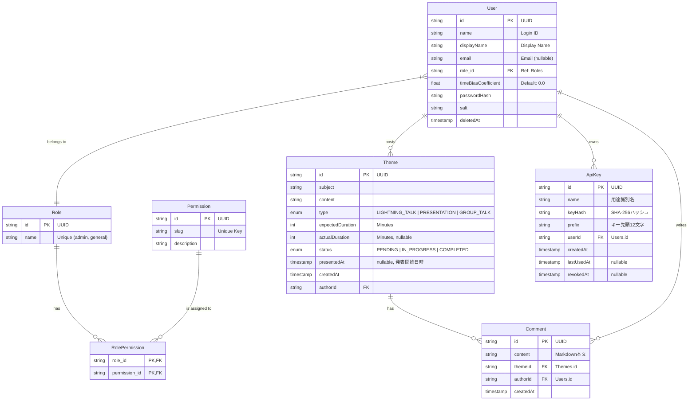

# ライトニングトーク会用 お題箱アプリケーション 設計書

## 1. システムアーキテクチャ (System Architecture)

### 1.1 システム構成

本システムは Next.js (App Router) と Database の2層構造とし、Docker Compose 上で動作する。
Frontend と Backend API は Next.js フレームワーク内に統合される。

- **Framework**: Next.js (React Server Components, App Router)
- **Base Path Routing**: 環境変数 `BASE_PATH` に基づいて Next.js の `basePath` 設定を適用し、リバースプロキシ配下などのサブパスでのホスティングに対応する。
- **Markdown Rendering**: `react-markdown` などを利用して、サニタイズ処理(`rehype-sanitize`等)を施しつつ、投稿されたMarkdown形式の本文をリッチテキストとして表示する。投稿画面のリアルタイムプレビュー用にも同レンダリング処理を共通利用し、実装レイアウトの一貫性を確保する。
- **Textarea Tab Key Handling**: 投稿画面の本文入力 textarea において、Tab キー押下時にブラウザデフォルトのフォーカス移動を `preventDefault()` で抑制し、カーソル位置にタブ文字（`\t`）を挿入する。`onKeyDown` イベントハンドラで `selectionStart` / `selectionEnd` を操作し、挿入後のカーソル位置を適切に更新する。
- **Database**: PostgreSQL
- **Infrastructure**: Docker / Docker Compose

### 1.2 コンテナ構成

(docker-compose.yml の構成予定)

- **app**: Next.js アプリケーション (Node.js)
- **db**: PostgreSQL データベース

## 2. データベース設計 (Database Design)

### 2.1 ER図 (Entity Relationship)

データモデルは Prisma Schema を使用して定義・管理する。
以下は概念的なER図である。



### 2.2 テーブル定義

#### 2.2.1 Users テーブル

| カラム名              | 型        | 制約             | 説明                  |
| :-------------------- | :-------- | :--------------- | :-------------------- |
| id                    | UUID      | PK               | ユーザーID            |
| name                  | VARCHAR   | NOT NULL, UNIQUE | ログインID (認証用)   |
| display_name          | VARCHAR   | NOT NULL         | 表示名                |
| email                 | VARCHAR   | NULL             | メールアドレス        |
| role_id               | UUID      | FK, NOT NULL     | ロールID (Roles.id)   |
| time_bias_coefficient | DOUBLE    | DEFAULT 0.0      | 予想時間のズレ係数    |
| password_hash         | VARCHAR   | NOT NULL         | パスワードハッシュ    |
| salt                  | VARCHAR   | NOT NULL         | パスワードソルト      |
| deleted_at            | TIMESTAMP | NULL             | 削除日時 (論理削除用) |

#### 2.2.2 Roles テーブル

| カラム名 | 型      | 制約             | 説明                      |
| :------- | :------ | :--------------- | :------------------------ |
| id       | UUID    | PK               | ロールID                  |
| name     | VARCHAR | UNIQUE, NOT NULL | ロール名 (admin, general) |

#### 2.2.3 Permissions テーブル

| カラム名    | 型      | 制約             | 説明                          |
| :---------- | :------ | :--------------- | :---------------------------- |
| id          | UUID    | PK               | 権限ID                        |
| slug        | VARCHAR | UNIQUE, NOT NULL | 権限識別子 (例: draw_omikuji) |
| description | TEXT    |                  | 権限の説明                    |

#### 2.2.4 RolePermissions テーブル (中間テーブル)

| カラム名      | 型   | 制約   | 説明           |
| :------------ | :--- | :----- | :------------- |
| role_id       | UUID | PK, FK | Roles.id       |
| permission_id | UUID | PK, FK | Permissions.id |

#### 2.2.5 Themes テーブル

| カラム名          | 型                 | 制約              | 説明                                                                        |
| :---------------- | :----------------- | :---------------- | :-------------------------------------------------------------------------- |
| id                | UUID               | PK                | お題ID                                                                      |
| subject           | VARCHAR            | NOT NULL          | 件名                                                                        |
| content           | TEXT               | NOT NULL          | 本文                                                                        |
| type              | VARCHAR            | NOT NULL          | お題タイプ (LIGHTNING_TALK / PRESENTATION / GROUP_TALK)                     |
| expected_duration | INTEGER            | NOT NULL          | 予想所要時間(分)                                                            |
| actual_duration   | INTEGER            | NULL              | 実績所要時間(分)                                                            |
| status            | ThemeStatus (enum) | DEFAULT 'PENDING' | ステータス (PostgreSQL enum ThemeStatus: PENDING / IN_PROGRESS / COMPLETED) |
| author_id         | UUID               | FK                | 投稿者ID (Users.id)                                                         |
| presented_at      | TIMESTAMP          | NULL              | 発表開始日時 (IN_PROGRESS遷移時に記録)                                      |
| created_at        | TIMESTAMP          | DEFAULT NOW()     | 作成日時                                                                    |

#### 2.2.6 ApiKeys テーブル

| カラム名     | 型        | 制約          | 説明                                     |
| :----------- | :-------- | :------------ | :--------------------------------------- |
| id           | UUID      | PK            | APIキーID                                |
| name         | VARCHAR   | NOT NULL      | 用途識別名                               |
| key_hash     | VARCHAR   | NOT NULL      | APIキーのSHA-256ハッシュ値               |
| prefix       | VARCHAR   | NOT NULL      | APIキーの先頭12文字（識別用）            |
| user_id      | UUID      | FK, NOT NULL  | 発行者ID (Users.id)                      |
| created_at   | TIMESTAMP | DEFAULT NOW() | 作成日時                                 |
| last_used_at | TIMESTAMP | NULL          | 最終使用日時                             |
| revoked_at   | TIMESTAMP | NULL          | 無効化日時（設定済みの場合はキーが無効） |

#### 2.2.7 Comments テーブル

| カラム名   | 型        | 制約          | 説明                         |
| :--------- | :-------- | :------------ | :--------------------------- |
| id         | UUID      | PK            | コメントID                   |
| content    | TEXT      | NOT NULL      | コメント本文（Markdown形式） |
| theme_id   | UUID      | FK, NOT NULL  | 対象お題ID (Themes.id)       |
| author_id  | UUID      | FK, NOT NULL  | 投稿者ID (Users.id)          |
| created_at | TIMESTAMP | DEFAULT NOW() | 作成日時                     |

- `theme_id` の外部キー制約は `ON DELETE CASCADE` とし、お題削除時に関連コメントも一括削除する。
- `author_id` の外部キー制約は `ON DELETE SET NULL`とし、ユーザー削除時にコメントは残す（投稿者は「削除されたユーザー」表示に切り替わる）。

## 3. API設計 / Server Actions

Next.js App Router の機能を活用し、クライアントからの操作は Server Actions を主体に実装する。
クライアントのコンテキスト依存が強い処理や外部システムとの連携が必要な場合は Route Handlers (`/app/api/`) を使用する。

### 3.1 Server Actions (Main Operations)

サーバー関数は `use server` ディレクティブを使用して定義する。

#### Auth Actions

- `login(formData)`: ログイン処理 (Cookie発行)
- `logout()`:ログアウト処理 (Cookie削除)
- `register(formData)`: 新規ユーザー登録

#### Theme Actions

- `postTheme(data)`: お題投稿
- `updateTheme(id, data)`: お題編集（投稿者本人かつステータスが `PENDING` の場合のみ）
  - 入力: お題ID、件名、本文、お題タイプ、予想所要時間
  - 処理: 認証チェック → お題取得 → 投稿者本人確認 → ステータスが `PENDING` であることを確認 → 入力バリデーション（投稿時と同等）→ DB更新
  - 戻り値: `{ success: boolean, error?: string }`
- `deleteTheme(id)`: お題削除
- `updateThemeStatus(id, status)`: お題ステータス変更
- `drawOmikuji(filters)`: **排他制御**を実行しお題をランダムに抽選
- `drawOldestTheme(filters)`: **排他制御**を実行し一番古いお題を選出・取得
- `passTheme(id)`: パス (引き直し) - お題を未消化に戻す
- `completeTheme(id, actualDuration)`: 完了報告 (実績時間の記録と係数更新)
- `expireTimedOutThemes()`: 発表中タイムアウトチェック（`presentedAt` から1時間経過した `IN_PROGRESS` のお題を `COMPLETED` に自動更新。`actualDuration` は `null` のままとする）

#### User Actions (Admin)

- `updateUserRole(userId, newRole)`: 権限変更

#### Settings Actions

- `changePassword(formData)`: パスワード変更
  - 入力: 現在のパスワード、新しいパスワード、新しいパスワード（確認）
  - 処理: 入力チェック → パスワード長さチェック → 確認入力一致チェック → 新旧パスワード一致チェック → 現在のパスワード検証 → パスワードハッシュ・ソルト再生成 → DB更新
  - 戻り値: `{ success: boolean, error?: string }`
  - 将来的に設定項目が増えた場合、このグループにアクションを追加する（例: `updateProfile` 等）

#### Settings Actions – Profile

- `updateProfile(formData)`: プロフィール更新（表示名・メールアドレス）
  - 入力: 表示名、メールアドレス（任意）
  - 処理: 入力チェック → 表示名必須チェック → メールアドレス形式チェック（入力時）→ DB更新
  - 戻り値: `{ success: boolean, error?: string }`

#### API Key Actions (Admin)

- `getApiKeys()`: ログインadminユーザー自身が発行したAPIキー一覧を取得
- `createApiKey(name)`: 新しいAPIキーを発行。生のキーを一度だけ返却し、DBにはSHA-256ハッシュを保存
  - 戻り値: `{ success: boolean, error?: string, apiKey?: string }`
- `revokeApiKey(keyId)`: APIキーを無効化（`revokedAt` を設定）
- `deleteApiKey(keyId)`: APIキーレコードを完全に削除

#### Comment Actions

- `getComments(themeId)`: 指定お題のコメント一覧を取得（作成日時昇順）
  - 認証: ログイン済みユーザーのみ
  - 処理: 対象お題のステータスが `IN_PROGRESS` または `COMPLETED` であることを確認
  - 戻り値: `{ success: boolean, comments?: CommentWithAuthor[], error?: string }`
- `addComment(themeId, content)`: コメントを追加
  - 入力: お題ID、コメント本文（Markdown）
  - 認証: ログイン済みユーザーのみ
  - 処理: 認証チェック → 対象お題取得 → ステータスが `IN_PROGRESS` または `COMPLETED` であることを確認 → コメント本文の空文字チェック → DB保存
  - 戻り値: `{ success: boolean, error?: string }`
- `deleteComment(commentId)`: コメントを削除
  - 認証: ログイン済みユーザーのみ
  - 処理: 認証チェック → コメント取得 → 自分のコメントまたは `delete_others_posts` 権限を持つユーザーであることを確認 → DB削除
  - 戻り値: `{ success: boolean, error?: string }`

### 3.2 Route Handlers (API Endpoints)

必要に応じて以下のエンドポイントを実装する。基本的には Server Actions で完結させる方針とする。

- `GET /api/me`: 現在のログインユーザー情報取得 (Client Component初期化用など)
  - 認証: Cookie認証またはAPIキー認証
- `GET /api/users`: ユーザー一覧取得（admin権限必要）
  - 認証: Cookie認証またはAPIキー認証
  - レスポンス: `Array<{ displayName, email }>`
  - 有効なユーザー（`deletedAt` が `null`）のみ返却する。
- `GET /api/users/admin`: 管理ユーザー一覧取得（admin権限必要）
  - 認証: Cookie認証またはAPIキー認証
  - レスポンス: `Array<{ displayName, email }>`
  - admin ロールを持つ有効なユーザーのみ返却する。
- `GET /api/themes/remaining`: 未消化のお題統計情報取得（認証不要）
  - レスポンス: `{ count: number, totalExpectedDuration: number, totalCorrectedDuration: number }`
- `GET /api/themes/active`: 現在発表中(`status='IN_PROGRESS'`)のお題を取得
  - 認証: Cookie認証またはAPIキー認証
  - レスポンス: `{ id, subject, content, type, ... }` （ポーリングやSWRを利用してクライアントから定期購読する）

### 3.3 認証機構 (Authentication Mechanism)

- **方式1: HttpOnly Cookie (JWT)**
  - ブラウザからのリクエスト用。ログイン時にJWTを発行し、HttpOnly Cookieに保存する。
  - **ライブラリ**: `jose` (JWT生成・検証)
- **方式2: APIキー認証**
  - 外部システム連携用。adminユーザーのみが発行可能。
  - APIリクエスト時に `Authorization: Bearer ogt_...` または `X-API-Key: ogt_...` ヘッダーで送信。
  - APIキーはSHA-256でハッシュ化してDBに保存。生のキーは発行時に一度だけ表示。
  - キー使用時に `lastUsedAt` を更新。無効化（`revokedAt` 設定）済みのキーでの認証は拒否。
- **Middleware**: `middleware.ts` を使用して、保護されたルートへのアクセス制御を行う。APIルートはMiddlewareの対象外とし、各Route Handler内で認証を行う。
- **認証優先度**: APIキーヘッダーが存在する場合はAPIキー認証を優先し、ない場合はCookie認証にフォールバックする。

## 4. フロントエンド設計 (Frontend Design)

### 4.1 ディレクトリ構成案 (App Router)

```

src/ (またはルート直下)
├── app/ # App Router ページ/レイアウト
│ ├── (auth)/ # Route Group: 認証関連 (login, register)
│ ├── (main)/ # Route Group: メイン画面 (layout共有)
│ │ ├── page.tsx # トップ画面 (メニュー)
│ │ ├── themes/page.tsx # お題一覧
│ │ ├── post/page.tsx # 投稿画面
│ │ ├── draw/page.tsx # くじ引き画面
│ │ ├── admin/ # 管理画面
│ │ │ └── page.tsx # 管理ページ
│ │ └── settings/ # 設定画面
│ │ └── page.tsx # 設定ページ (タブ構成)
│ ├── api/ # Route Handlers
│ ├── globals.css # グローバルスタイル
│ └── layout.tsx # ルートレイアウト
├── components/ # UIパーツ
│ ├── ui/ # 汎用UI (Button, Input etc - shadcn/ui想定)
│ └── features/ # 機能単位 (ThemeCard, DrawDisplay, SettingsPanel etc)
├── lib/ # ユーティリティ (prisma client, auth config)
├── actions/ # Server Actions (auth.ts, themes.ts, settings.ts, apiKeys.ts)
└── types/ # 型定義

```

### 4.2 状態管理

- **Server Component**: データ取得 (Fetching) を担当。Prisma を直接コールしてDBからデータを取得し、Props として Client Component に渡す。
- **Client Component (React Context / Hooks)**:
  - **AuthContext**: ログイン状態の保持 (必要であれば)
  - **TimerContext / Hook**: くじ引き画面でのタイマー管理、演出状態の管理
  - **useOptimistic**: Server Actions 実行時の楽観的UI更新に使用

### 4.3 画面構成 (Routing)

仕様書の画面遷移図に準拠する。

### 4.4 ヘッダー (Header Component)

共通ヘッダー (`components/features/Header.tsx`) に以下の要素を配置する。

- **左側**: アプリ名（トップページへのリンク）
- **中央**: メインナビゲーション（ホーム、お題一覧、投稿、くじ引き、管理）
- **右側**: ユーザーエリア
  - **表示名**: クリックすると `/settings`（設定画面）へ遷移するリンクとする。ホバー時に視覚的フィードバック（下線やカーソル変更など）を表示し、クリック可能であることを示す。
  - **ログアウトボタン**

## 5. ロジック詳細 (Business Logic)

### 5.1 お題抽選と排他制御

- Prisma の Interactive Transactions を使用する。
- 同時リクエストの競合を防ぐため、可能な限り `SELECT ... FOR UPDATE SKIP LOCKED` (Raw Queryが必要になる可能性あり) や、Optimistic Concurrency Control (OCC) を検討する。

### 5.2 ズレ係数計算ロジック

- Server Action `completeTheme` 内で実装。
- 仕様書 $3.6$ の数式に基づき $k$ を更新する。

### 5.3 発表中タイムアウト（自動完了）ロジック

- **目的**: 発表中状態のまま放置されたお題を自動的に消化済みにする。
- **トリガー条件**: `presentedAt` からの経過時間が **60分**を超えた場合。
- **実装方式**: サーバーサイド遅延評価（Lazy Evaluation）。cronジョブは用いず、以下のタイミングでチェックを実行する。
  - `GET /api/themes/active` 呼び出し時（ポーリング毎にチェック）
  - `drawOmikuji` / `drawOldestTheme` 実行時（抽選前にチェック）
  - `GET /api/themes/remaining` 呼び出し時
- **処理内容**:
  1. `status = 'IN_PROGRESS'` かつ `presentedAt + 60分 < NOW()` のお題を検索。
  2. 該当お題の `status` を `COMPLETED` に更新。`actualDuration` は `null` のままとする。
  3. ズレ係数の再計算は行わない（正常な発表終了ではないため）。

## 6. セキュリティ (Security)

### 6.1 権限マトリクス

| 機能             | Admin | General | 備考                               |
| :--------------- | :---: | :-----: | :--------------------------------- |
| 投稿             |   ○   |    ○    |                                    |
| 編集(自)         |   ○   |    ○    | 未消化の自分の投稿のみ             |
| 閲覧(自)         |   ○   |    ○    |                                    |
| 閲覧(他・詳細)   |   ○   |    ☓    | 他人は件名のみ                     |
| くじ引き         |   ○   |    ☓    | 権限設定による                     |
| 削除(他)         |   ○   |    ☓    |                                    |
| 設定変更(自)     |   ○   |    ○    | 自身の設定のみ                     |
| APIキー管理      |   ○   |    ☓    | adminのみ発行可                    |
| コメント追加     |   ○   |    ○    | 発表中・消化済みのお題に対してのみ |
| コメント閲覧     |   ○   |    ○    | 発表中・消化済みのお題に対してのみ |
| コメント削除(自) |   ○   |    ○    | 自分のコメントのみ                 |
| コメント削除(他) |   ○   |    ☓    | `delete_others_posts` 権限が必要   |

## 7. 型定義補足 (Type Supplements)

### CommentWithAuthor

Server Actions および画面表示で使用する、投稿者情報を結合したコメント型。

```typescript
type CommentWithAuthor = {
  id: string;
  content: string; // Markdown本文
  themeId: string;
  authorId: string | null;
  author: {
    displayName: string;
  } | null; // ユーザー削除済みの場合はnull
  createdAt: Date;
};
```
