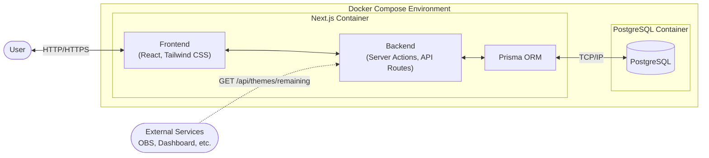

# ライトニングトーク会用 お題箱アプリケーション 仕様書

## 1. 概要

チーム内のライトニングトーク（LT）会で使用する、トークテーマ（お題）を管理・抽選するためのアプリケーション。
参加者が話したいことや聞いてみたいことを投稿し、LT当日にランダムで選出することで、スムーズな会進行を補助する。

## 2. 実装技術 (Technical Stack)



- **Framework**: Next.js (App Router) - FrontendとBackend APIを統合管理
- **Routing**: Next.js File-system Routing
- **Language**: TypeScript
- **Styling**: Tailwind CSS (現在のデファクトスタンダードとして採用)
- **State Management**: React Context (Client Component用) + Server Actions (Server状態管理)
- **Database**: PostgreSQL (Dockerコンテナで運用)
- **ORM**: Prisma (Server Action / API Route上で動作)
- **Infrastructure**: Docker, Docker Compose (App(Next.js), DBの2コンテナ構成)
- **Concurrency Control**: DBトランザクションを利用した排他制御（Prisma経由で実装）

## 3. 機能要件

### 3.1. お題投稿機能

- ユーザーはお題の「件名（Subject）」と「本文（Content）」を入力・投稿できる。
- **お題タイプ**を選択できる（将来的な拡張を考慮）。
  - **LIGHTNING_TALK (1人が発表)**: 従来のLTスタイル。
  - **PRESENTATION (しっかり発表)**: 少し長めの発表スタイル。
  - **GROUP_TALK (みんなで話す)**: ディスカッションやアンケート形式。
- **予想所要時間（分単位）**を入力・設定できる。
  - ※なお `LIGHTNING_TALK` の場合、予想所要時間の上限は10分とする。
- ログインユーザーとして投稿し、投稿者情報（ユーザー名など）がお題に紐づく。

### 3.2. お題一覧表示機能

- 投稿されたお題の一覧を表示する。
- 消化済み（既に使用された）お題と、未消化のお題を区別して表示する。
- **`view_others_posts` 権限がない場合**: 他人の投稿はお題の「件名（Subject）」のみ閲覧可能とし、本文や投稿者は隠す（自分の投稿は閲覧可能）。
- **`view_others_posts` 権限がある場合 (Admin等)**:
  - 全ての情報（件名、本文、投稿者）を閲覧可能。
  - **時間予測情報の表示**:
    - 投稿者が設定した「予想所要時間」。
    - 投稿者の「ズレ係数」を掛け合わせた「**補正予測所要時間**」を表示し、より現実的な見積もりを確認できる。

### 3.3. ガムトーク（くじ引き）機能

- **`draw_omikuji` 権限を持つユーザーのみ実行可能**。
- **抽選フィルタリング**: くじを引く前に条件（お題タイプ、予想時間範囲など）を指定可能。
- **排他制御**: 複数人が同時に引いても、同一のお題が重複して選出されないようロック制御を行う。
- 未消化のお題を選出・表示する方法として、以下の2種類をサポートする。
  - **ランダム選出 (おみくじ)**: 未消化のお題の中からランダムに1つを選出する。
  - **一番古い投稿の選出**: 未消化のお題の中で最も古い（投稿日時が古い）ものを1つ選出する。長く残っているお題を優先的に消化したい場合に使用する。
- **お題タイプに応じた演出**:
  - `LIGHTNING_TALK`の場合: スポットライトが当たるような演出など。
  - `PRESENTATION`の場合: 講義のような演出など。
  - `GROUP_TALK`の場合: みんなが吹き出しで話しているような演出など。
- **発表・アクション**:
  - **タイマー機能**: 発表開始と同時に内部的にカウントアップタイマーを作動させる（画面には表示しない）。
    - ユーザーが時間を気にしすぎないよう、経過時間は非表示とする。
    - 完了時に自動的に計測時間を「実際にかかった時間」として記録、または入力フォームの初期値としてセットする。
  - **パス（引き直し）**: やむを得ない事情がある場合、選出されたお題を「未消化」に戻して引き直すことができる（連続パス回数制限の設定も検討）。
- **完了処理と時間記録**:
  - 話し終わった後、**「実際にかかった時間」**（タイマー連動または手入力）を記録して完了（消化済み）とする。
  - この実績値に基づき、投稿ユーザーの「ズレ係数」を再計算・更新する。

### 3.4. お題管理機能

- 誤って投稿したお題の削除（自身の投稿、または **`delete_others_posts` 権限を持つユーザー**は他人の投稿も削除可能）。
- ステータスの手動変更（未消化 ⇔ 消化済み）。
  - 管理者は誤って消化済みにしたお題を「未消化」にリセット可能。
- **ユーザー削除時の対応**:
  - ユーザーが削除（論理削除推奨）された場合、投稿したお題は削除せず残す。
  - 投稿者情報は「削除されたユーザー」等の表示に切り替わる。

### 3.5. ユーザー認証・権限管理機能

- ユーザーログイン・ログアウト機能。
- 投稿者の識別（誰がどのお題を出したか分かるようにする）。
- **ロール（役割）による権限管理**:
  - **Admin (管理者)**: 以下の全権限を持つ。
  - **General (一般)**: デフォルトでは権限を持たない（または設定により付与）。
- **定義される権限**:
  - `draw_omikuji`: おみくじを引く権限。
  - `view_others_posts`: 他人の投稿の詳細（本文・投稿者）を閲覧する権限。
  - `delete_others_posts`: 他人の投稿を削除する権限。

### 3.6. システムロジック詳細

- **ズレ係数 (Time Bias Coefficient) $k$ の計算仕様**:
  - **補正後予測時間 (Corrected Prediction)**:
    - $$T_{corrected} = T_{predicted} \times e^k$$
  - **係数 $k$ の更新式 (Exponential Moving Average)**: - $$k_{new} = (1 - \alpha) \times k_{old} + \alpha \times (\ln(T_{actual}) - \ln(T_{predicted}))$$ - $\alpha$ (学習率): 定数（例: 0.2）。最新の実績をどの程度強く反映するかを決定する。
    - **計算時のセーフガード (Math Logic Safeguard)**:
      - 対数計算 ($\ln$) における $0$ や負の数を回避するため、以下のバリデーションを設ける。
      - **$T_{predicted}$ (予想)**: 入力必須かつ正の値とする（UIで制限）。$0$以下の場合は計算対象外。
      - **$T_{actual}$ (実績)**: $0$以下が入力された場合、最小値（例: 0.1分 = 6秒）にクリップして計算するか、係数更新をスキップする。

### 3.7. ユーザー設定機能

- ログイン済みユーザーは **設定画面 (`/settings`)** から自身のアカウント設定を変更できる。
- 設定画面はタブ（またはセクション）構成とし、将来的な設定項目の追加に対応できる拡張性を持たせる。
- 初期リリースでは以下の設定カテゴリを提供する。

#### 3.7.1. パスワード変更

- ユーザーは自身のパスワードを変更できる。
- 変更時には以下の入力を必須とする:
  - **現在のパスワード**: 本人確認のため、現在のパスワードを入力する。
  - **新しいパスワード**: 変更後のパスワードを入力する。
  - **新しいパスワード（確認）**: 入力ミス防止のため、新しいパスワードを再入力する。
- バリデーション:
  - 現在のパスワードが正しいことを検証する。
  - 新しいパスワードと確認入力が一致していることを検証する。
  - 新しいパスワードが現在のパスワードと異なることを検証する。
- パスワード変更成功後、既存のセッションは維持する（再ログイン不要）。
- パスワード変更の成功・失敗をユーザーにフィードバックする。

#### 3.7.2. 将来的な拡張候補（未実装）

- 表示名の変更
- プロフィール設定
- 通知設定
- テーマ・表示設定

### 3.8. 外部連携API機能

- **未消化お題情報取得 API (`GET /api/themes/remaining`)**:
  - **認証**: 不要（パブリックアクセス可能）。
  - **目的**: 外部ダッシュボードやOBS等の配信ツールで、現在の進行状況や残り時間を表示するために使用する。
  - **レスポンス内容 (JSON)**:
    - **未消化お題数 (`count`)**: 現在残っているお題の数。
    - **予想所要時間合計 (`totalExpectedDuration`)**: 投稿者が入力した予想時間の単純合計。
    - **補正後所要時間合計 (`totalCorrectedDuration`)**: 各投稿者の「ズレ係数」を適用した補正時間の合計。小数第2位で丸める。

## 4. 画面遷移図 (ワイヤーフレーム案およびRouting)

1. **`/login` (app/login/page.tsx) : ログイン画面**
   - ユーザー名入力
   - パスワード入力
   - ログインボタン
   - 新規ユーザー登録リンク -> `/register`
   - ※未認証ユーザーはここにリダイレクト

2. **`/register` (app/register/page.tsx) : ユーザー登録画面**
   - ユーザー名入力
   - パスワード入力
   - 登録ボタン

3. **`/` (app/page.tsx) : トップ画面 (メニュー)**
   - ヘッダー
     - ログインユーザー名表示（クリックで `/settings` へ遷移）
     - ログアウトボタン
   - メインメニュー（ナビゲーション）
     - 「お題一覧を見る」ボタン -> `/themes`
     - 「お題を投稿する」ボタン -> `/post`
     - 「お題を引く（くじ引き）」ボタン -> `/draw` (権限保持者のみ)
     - 「管理画面」ボタン -> `/admin` (管理者のみ)

4. **`/themes` (app/themes/page.tsx) : お題一覧画面**
   - お題リスト表示
     - 消化済み/未消化のフィルタリング
     - 権限なし/未ログイン: 件名のみ表示
     - 権限あり: 詳細表示（本文・投稿者・予測時間など）
   - 「お題を投稿する」ボタン

5. **投稿画面 (app/post/page.tsx)**
   - 件名入力エリア
   - 本文入力エリア
   - お題タイプ選択 (LIGHTNING_TALK / PRESENTATION / GROUP_TALK)
   - 投稿ボタン

6. **くじ引き演出画面 (app/draw/page.tsx)**
   - 「ストップ」または「引く」アクション
   - **演出**: 結果表示の前にGIF画像を1周表示させる（ロード/待機演出）
   - 結果表示
   - 投稿者名の表示（誰のお題か分かるようにする）
   - 「このお題で話す」確定ボタン

7. **`/settings` (app/(main)/settings/page.tsx) : 設定画面**
   - タブ（またはセクション）構成で設定カテゴリを切り替え
   - 「パスワード変更」タブ（初期リリース）
     - 現在のパスワード入力
     - 新しいパスワード入力
     - 新しいパスワード（確認）入力
     - 変更ボタン
     - 成功・エラーメッセージ表示
   - 将来的にタブ追加で設定項目を拡張可能

8. **`/admin` (app/(main)/admin/page.tsx) : 管理画面**
   - お題の編集・削除
   - ユーザー管理（権限変更など）
   - 管理者権限を持つユーザーのみアクセス可能

## 5. データ構造案

### User (ユーザー)

```json
{
  "id": "string (UUID)",
  "name": "string (表示名)",
  "role": "string (admin | general)",
  "timeBiasCoefficient": "number (ズレ係数 k, 初期値: 0.0)",
  "passwordHash": "string (Hash(salt + password))",
  "salt": "string (ランダム生成されたソルト)"
}
```

### Theme (お題)

```json
{
  "id": "string (UUID)",
  "subject": "string (お題の件名)",
  "content": "string (お題の本文)",
  "type": "enum (LIGHTNING_TALK | PRESENTATION | GROUP_TALK - 将来的に拡張可能)",
  "expectedDuration": "number (分 - 予想所要時間)",
  "actualDuration": "number (分 - 実際にかかった時間, nullable)",
  "isUsed": "boolean (消化済みフラグ)",
  "createdAt": "timestamp",
  "authorId": "string (User.id - 投稿者ID)"
}
```

## 6. 今後の検討事項

- デプロイ環境の検討（Vercel等のホスティングサービスか、Self-hostedか）。
- デザインのテイスト（ポップ、シンプル、etc）。
